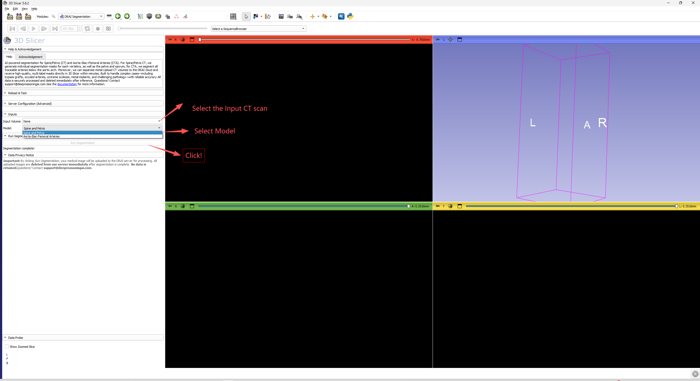
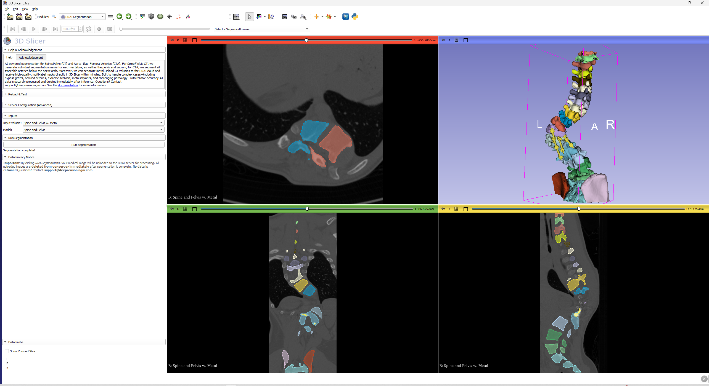
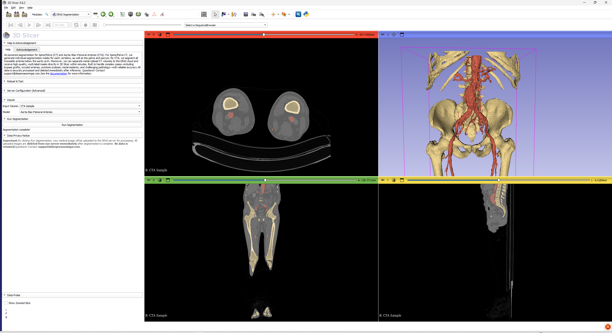

# DRAI Segmentation

A [3D Slicer](https://www.slicer.org/) extension for Deep Reasoning Technology-powered medical image segmentation of CT volumes.

## Description

DRAI Segmentation provides automatic, deep-learning-based segmentation of anatomical structures from CT scans. Volumes are uploaded to the DRAI cloud server for inference and the resulting multi-label segmentation masks are loaded directly into 3D Slicer for visualization and analysis.

### Supported Models 

| Model | Structures | Output Labels |
|-------|-----------|---------------|
| **Spine and Pelvis** | Cervical (C1-C7), Thoracic (T1-T12), Lumbar (L1-L6) vertebrae, metal implants, pelvis/hip | 1-25 (vertebrae), 29 (metal), 31+ (pelvis) |
| **Aorta-Iliac-Femoral** | Aorta, iliac and femoral arteries, surrounding bone | 1 (artery), 2 (bone) |

We will keep adding new models.

## Installation

### From the Extensions Manager

Once the extension is published in the 3D Slicer Extensions Index:

1. Open 3D Slicer
2. Go to **View > Extensions Manager**
3. Search for **DRAI Segmentation**
4. Click **Install**
5. Restart 3D Slicer

### Install from zip download

1. Download and extract the release zip
2. Open 3D Slicer
3. Drag and drop the `DRAISegmentation/DRAISegmentation.py` file onto the Slicer window
4. Select **"Add Python scripted modules to the application"** and click **OK**
5. Check the **DRAISegmentation** checkbox and click **Yes** to load the module

> **Note:** Do not use *"Install Extension from File"* in the Extensions Manager — that feature is for pre-built extension packages only. Use the drag-and-drop method above instead.

### Install from source (developers)

1. Clone this repository
2. Open 3D Slicer, go to **Edit > Application Settings > Modules**
3. Add the full path to the `DRAISegmentation/` folder under **"Additional module paths"**
4. Restart 3D Slicer

## Usage

1. Load a CT volume into 3D Slicer (drag-and-drop a DICOM folder or NIfTI file)
2. Open the **DRAI Segmentation** module (found under the **Segmentation** category)
3. Select the **Input Volume** from the dropdown
4. Choose a **Model** (Spine and Pelvis, or Aorta-Iliac-Femoral)
5. Click **Run Segmentation**
6. Review and accept the data privacy consent dialog
7. Wait for the segmentation to complete (progress is displayed in the progress bar)
8. The segmentation mask is automatically loaded into the scene as a Segmentation node with 3D surface rendering

## Data Privacy

- Your CT volume is uploaded to the DRAI server **only** for the duration of the segmentation
- All uploaded images are **deleted from the server immediately** after segmentation is complete
- **No data is retained** on the server
- A consent dialog is shown before every upload

## Requirements

- 3D Slicer 5.0 or later
- Network connectivity to the DRAI segmentation server
- CT volume loaded in the scene

## Screenshots

<!-- Replace these with actual screenshots of the module in use -->

*Module panel:*

*Spine and Pelvis Model Example:*

*Aorta-Illiac-Femoral Arteries Model Example:*

## Contributing

Bug reports and feature requests are welcome via [GitHub Issues](https://github.com/DeepReasoningAI/SlicerDRAISegmentation/issues).

## License

This extension is distributed under the terms of the BSD 3-Clause License. See [LICENSE](LICENSE) for details.

## Acknowledgements

Developed by **Deep Reasoning AI (DRAI)**. Welcome to check our website: https://deepreasoningai.com/.
